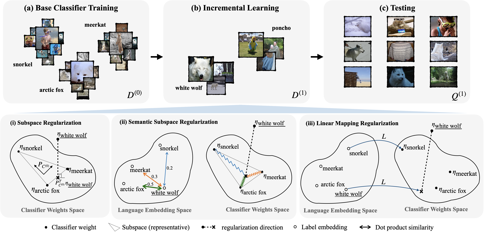

# Subspace Regularizers

This repo contains the source code for the following paper: [**Subspace Regularizers for Few-Shot Class Incremental Learning**](https://arxiv.org/abs/2110.07059), Afra Feyza Akyürek, Ekin Akyürek, Derry Wijaya, Jacob Andreas. ICLR 2022. [link](https://arxiv.org/abs/2110.07059)



Few-shot class incremental learning (FSCIL) refers to the problem of updating a trained classifier to discriminate among an expanded set of classes with limited labeled data. We focus on the image classification problem. The two key challenges are catastrophic forgetting of old classes and overfitting to new classes due to small data. Subspace regularizarization while helps controlling forgetting, it remedies overfitting by regularizing the novel weights towards a feature space learned by old classes. Thanks to this simple fix, we are able to augment the last linear layer to accommodate more classes and continue fine-tuning the linear classifier on the new data as usual.


## Installation

Please consider using `sh setup.sh` to create a conda environment and install required packages.

## Download Data and Pretrained Models

### Multi Session

If running `multi-session` create and navigate to `data/miniImageNet` in this repo. Please download the file subspace-mini-data.tar.gz from this [link](https://drive.google.com/drive/folders/1pDNqrEDq6H03-dLLLYyDS9FsKDQh24Ug?usp=sharing), uncompress the contents under `data/miniImageNet`. You should have two files under `data/miniImageNet`: `all.pickle` and `class_names.txt`. You may consider using the command line utility [gdrive](https://github.com/prasmussen/gdrive) for downloading files from Google Drive. [This guide](https://medium.com/geekculture/how-to-upload-file-to-google-drive-from-linux-command-line-69668fbe4937) is also helpful for setting up gdrive. If using gdrive, you will need the `fileId`s, and they are usually visible in the shareable links.

Create a folder named `dumped` and cd into it. Download pretrained models for `multi-session` from the same link above (multi-session-resnet18.tar.gz), extract and place the contents under `dumped/backbones/continual/resnet18`. The numbered folder names refer to the seeds. Eventually you will have `dumped/backbones/continual/resnet18/1`, `dumped/backbones/continual/resnet18/2`, etc.

## Running

The repo currently supports only multi-session experiments.

### Using provided pretrained models

Sample scripts are under `scripts/continual` for `multi-session`. In every script, at the beginning we provide slurm options for batch jobs. Feel free to ignore this part if you're not using Slurm. you will see a nested for loop which we used for hyperparameter tuning while current values indicate the best parameters. Each experiment is run for 10 different seeds. If you are interested in only a single run, scroll down to the bottom for the respective command in every `.sh` file. Make sure to set the desired seed between 1-10.

The existing commands use memory (+M setup in the paper). In order to turn off memory replay, simply remove the options `--n_base_support_samples 1` and `--memory_replay 1` which will set them to zero. When switching between +/-M, make sure to edit your `EXP_FOLDER` parameter in the sh scripts to avoid overriding your previous experiments.

### Training the backbone from scratch

If you would like to train the backbones from scratch, you may use `scripts/continual/slurm_run_backbone.sh`. After training your backbones, please refer to the above section `Using pretrained models`, making sure you point to your trained backbones in respective scripts.

## Compute

All experiments were run on 32GB NVIDIA Tesla V100 nodes, however memory requirement is likely less.

## Contacts
Feel free to reach out to with questions, or open issues.

Afra Feyza Akyürek (akyurek@bu.edu)  
Ekin Akyürek (akyurek@mit.edu)

## Acknowledgment
A significant portion of this repository is based on [RFS source code](https://github.com/WangYueFt/rfs).

```
@inproceedings{akyurek2022subspace,
  title={Subspace Regularizers for Few-Shot Class Incremental Learning},
  author={Aky{\"u}rek, Afra Feyza and Aky{\"u}rek, Ekin and Wijaya, Derry and Andreas, Jacob},
  booktitle={International Conference on Learning Representations},
  year={2022}
}
```
